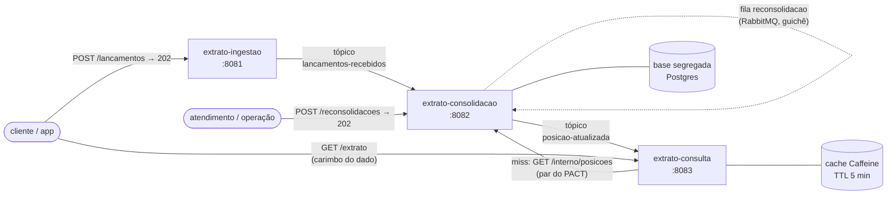

# Consolidador de Extrato — Open Finance

[](https://github.com/leofaria-code/consolidador-extrato/actions/workflows/verify.yml)

Projeto final em grupo do módulo **BE-JV-010 — Arquitetura de Software Ágil II** (Escalação Tech · Dev. Back-End Java Especialista · turma Caixa).

**Tema:** Consolidador de extrato / Open Finance — ingestão por tópicos → agregação → cache de consulta.

**Grupo:** Leo (arquiteto) · Sandy (dev mensageria) · Marcos (dev cache/dados) · Rodrigo (dev testes/contrato)

## Estado atual

✅ **Projeto entregue** — 6 incrementos, 7 ADRs, CI duplo (plano B + e2e) verde. Resta o ensaio cronometrado; **banca em 15/07/2026**.

| Entregável | Status |
|---|---|
| Pacote de requisitos (personas, 6 sessões de elicitação, user stories) | ✅ `docs/requisitos/` |
| ADR-001 (stack) · ADR-002 (decomposição) · `docs/arquitetura.md` | ✅ |
| Esqueleto multi-módulo (4 módulos, REST + health + smoke tests) | ✅ |
| Incremento 1 — tópico de ingestão + consumidor idempotente (Kafka) | ✅ |
| Incremento 2 — consolidação + base segregada + evento `posicao-atualizada` (ADR-004, ADR-005) | ✅ |
| Incremento 3 — cache na consulta + invalidação + carimbo (ADR-006) | ✅ |
| Incremento 4 — fila de reconsolidação (RabbitMQ) + retry/DLQ (ADR-007) | ✅ |
| Incremento 6 — observabilidade: correlação ponta a ponta + logs JSON | ✅ |
| Incremento 5 — contract test PACT consulta↔consolidação | ✅ |
| AVALIACAO.md (notas validadas pelo grupo) + demo docker-compose de um comando + coleções Postman + CI e2e | ✅ |
| Ensaio cronometrado da banca (roteiro pronto em `docs/roteiro-banca.md`) | ⏳ até 14/07 |

## Arquitetura em 30 segundos

Três serviços Quarkus independentes, cada um com sua própria base (ninguém lê a base do outro):



- **`extrato-ingestao`** (8081) recebe a ficha do lançamento, valida e publica no tópico `lancamentos-recebidos` (aceite assíncrono, `202`).
- **`extrato-consolidacao`** (8082) consome o tópico, incorpora o lançamento de forma idempotente, atualiza a posição da conta×competência e publica `posicao-atualizada`; também atende pedidos de reconsolidação via fila.
- **`extrato-consulta`** (8083) expõe o extrato consolidado com cache (Caffeine, TTL 5 min) e invalida a entrada quando recebe `posicao-atualizada`.

Detalhes e garantias de cada fluxo: `docs/arquitetura.md` · **diagramas de sequência/ER/resiliência/cache: [`docs/resumo-visual.md`](docs/resumo-visual.md)**.

## Pré-requisitos

- **Java 25** (LTS) e **Maven 3.9+** na `PATH`.
- **Docker** — só necessário para o perfil A (`plano-a-docker`), que sobe Kafka/RabbitMQ via Quarkus Dev Services. O perfil B (`plano-b-jvm`) roda 100% sem Docker.

## Instalar dependências

O projeto é um reactor multi-módulo (`shared-contracts` → `extrato-ingestao` / `extrato-consolidacao` / `extrato-consulta`); o Maven resolve a ordem de build automaticamente. Não há passo de "install" separado — o primeiro `mvn` abaixo já baixa tudo.

```bash
mvn -q dependency:go-offline   # opcional: baixa todas as dependências antes do primeiro build
```

## Compilar

```bash
mvn clean compile          # compila todos os módulos, sem rodar testes
mvn clean package          # compila e gera os artefatos (JARs) em cada módulo/target
```

## Testar

```bash
mvn clean test              # testes unitários de todos os módulos
mvn clean verify            # testes unitários + integração (perfil A por padrão — usa Docker quando necessário)
mvn clean verify -Pplano-b-jvm   # mesma suíte, perfil B — pura-JVM, sem Docker (critério 6: tem que passar assim)
mvn -pl extrato-ingestao verify -Pplano-b-jvm   # só um módulo, perfil B
```

## Rodar em modo dev

Cada serviço sobe individualmente com `quarkus:dev` (live reload). Portas fixas por módulo:

| Módulo | Porta | Comando |
|---|---|---|
| `extrato-ingestao` | 8081 | `mvn -pl extrato-ingestao quarkus:dev` |
| `extrato-consolidacao` | 8082 | `mvn -pl extrato-consolidacao quarkus:dev` |
| `extrato-consulta` | 8083 | `mvn -pl extrato-consulta quarkus:dev` |

Em modo dev o perfil A é o padrão: o Quarkus Dev Services sobe automaticamente os brokers via Docker quando o serviço precisa deles (Kafka para `extrato-ingestao`/`extrato-consolidacao`/`extrato-consulta`, RabbitMQ para `extrato-consolidacao`) — não precisa subir nada manualmente, só ter o Docker rodando.

## Testando o fluxo ponta a ponta

Com Docker rodando, abra **três terminais** e suba cada serviço (a ordem não importa, mas espere aparecer `Listening on: http://localhost:80NN` em cada um antes de seguir):

```bash
mvn -pl extrato-ingestao quarkus:dev       # terminal 1
mvn -pl extrato-consolidacao quarkus:dev   # terminal 2
mvn -pl extrato-consulta quarkus:dev       # terminal 3
```

**1. Confirme que os três estão de pé:**

```bash
curl http://localhost:8081/q/health
curl http://localhost:8082/q/health
curl http://localhost:8083/q/health
```

**2. Envie um lançamento para a ingestão** (resposta `202 ACEITO` — o processamento é assíncrono):

```bash
curl -X POST http://localhost:8081/lancamentos \
  -H "Content-Type: application/json" \
  -d '{
        "idCliente": "cliente-001",
        "idLancamentoOrigem": "lanc-0001",
        "instituicaoOrigem": "banco-a",
        "agencia": "0001",
        "conta": "12345-6",
        "tipo": "CREDITO",
        "valor": 150.00,
        "moeda": "BRL",
        "dataHoraOcorrencia": "2026-07-10T14:30:00-03:00",
        "idConsentimento": "consent-001",
        "descricao": "depósito",
        "categoriaOrigem": "transferencia"
      }'
```

**3. Consulte o extrato consolidado** (dê um segundo para o evento se propagar pelo tópico; a competência é o mês/ano de `dataHoraOcorrencia`, formato `AAAA-MM`):

```bash
curl http://localhost:8083/extrato/cliente-001/2026-07
```

O carimbo `atualizado às` do JSON de resposta muda quando a posição é reconsolidada. Para forçar a releitura ignorando o cache (sujeito ao limite de frequência da US-07):

```bash
curl "http://localhost:8083/extrato/cliente-001/2026-07?atualizar=true"
```

**4. (Opcional) Peça uma reconsolidação manual** — vai para a fila RabbitMQ e é processada de forma assíncrona (aceite imediato, `202`):

```bash
curl -X POST http://localhost:8082/reconsolidacoes \
  -H "Content-Type: application/json" \
  -d '{
        "idCliente": "cliente-001",
        "instituicaoOrigem": "banco-a",
        "agencia": "0001",
        "conta": "12345-6",
        "competencia": "2026-07",
        "motivo": "reprocessamento manual (teste)"
      }'
```

## Demo da banca — tudo de uma vez (docker-compose)

Sobe brokers reais (Kafka, RabbitMQ, Postgres) **e** os três serviços com um comando:

```powershell
./demo.ps1        # Windows (ou ./demo.sh no Linux/macOS)
```

Portas: `8081` ingestão · `8082` consolidação · `8083` consulta · `15672` RabbitMQ Management (`guest`/`guest`).
O roteiro `curl` da seção anterior funciona igual. A base é **descartável** (`drop-and-create` a cada subida do container da consolidação).

**Demonstrando a DLQ ao vivo** (US-08 — falha permanente não trava o fluxo):

```bash
# 1. injete um lançamento envenenado DIRETO no tópico (bypassa a validação da ingestão):
echo '{"idCliente":"c1","idLancamentoOrigem":"veneno-1","instituicaoOrigem":"banco-x","agencia":"0001","conta":"999","dataHoraOcorrencia":"2026-07-10T12:00:00-03:00"}' | \
  docker compose exec -T kafka sh -c "exec /opt/kafka/bin/kafka-console-producer.sh --bootstrap-server localhost:9092 --topic lancamentos-recebidos"

# 2. após 1+3 tentativas (~7s de backoff), a mensagem está na DLQ com a CAUSA nos headers:
docker compose exec -T kafka sh -c "exec /opt/kafka/bin/kafka-console-consumer.sh --bootstrap-server localhost:9092 --topic lancamentos-recebidos-dlq --from-beginning --max-messages 1 --timeout-ms 30000 --property print.headers=true"
```

A DLQ da fila de reconsolidação (`reconsolidacao-dlq`) é visível na UI do RabbitMQ em `http://localhost:15672`.

**Inspecionando os brokers e o banco do host** (os serviços conversam pela rede interna do compose; estas portas existem só para tooling):

| Recurso | Endereço no host | Ferramentas |
|---|---|---|
| Kafka (listener `EXTERNAL`) | `localhost:29092` | Offset Explorer, kafka-ui, plugin Kafka do IntelliJ |
| Postgres (`consolidacao`) | `localhost:15432` · `extrato`/`extrato` | psql, IntelliJ Database |
| RabbitMQ Management | `http://localhost:15672` · `guest`/`guest` | browser |

> Kafka do host exige o listener dedicado: mapear só a 9092 não funciona — o broker anuncia `kafka:9092` no metadata, nome que não resolve fora do compose (por isso o `EXTERNAL://localhost:29092`).

**Prefere Postman?** Importe `postman/consolidador-extrato.postman_collection.json` — são os requests da demo na ordem do roteiro, com testes automáticos (Run Collection → 27 asserções verdes; as asserções são relativas ao estado, então pode rodar quantas vezes quiser). Via CLI: `npx newman run postman/consolidador-extrato.postman_collection.json`.

> No Git Bash do Windows, o `sh -c "exec /opt/..."` evita a conversão automática de caminhos (MSYS) que quebraria o `/opt/kafka/...`.

### Rodando com observabilidade (Prometheus + Grafana, ADR-008)

```bash
docker compose --profile observabilidade up -d --build
```

Sobe tudo da demo **mais** Prometheus (`http://localhost:9090` — em `/targets`, os alvos do scrape) e Grafana (`http://localhost:3000`, sem login) com o dashboard **"Consolidador de Extrato — visão da banca"** provisionado: fluxo de lançamentos (aceito × incorporado × **repetido** — a idempotência como série temporal), cache hit ratio, DLQ por motivo (fica vermelho quando o veneno entra) e disjuntor/fallback. Rode o roteiro `curl`/Postman acima e veja os painéis mexerem.

Cada serviço expõe as métricas cruas em `/q/metrics` (formato Prometheus): contadores de negócio `extrato_*`, cache do Caffeine (`cache_gets_total`) e SmallRye FT (`ft_*`), além de JVM/HTTP. Portas 9090/3000 ocupadas na sua máquina? `PROMETHEUS_PORT=9091 GRAFANA_PORT=3001 docker compose --profile observabilidade up -d`.

## Perfis de execução

| Perfil | Quando usar | Comportamento |
|---|---|---|
| `plano-a-docker` (padrão, `-Pplano-a-docker` implícito) | Demo completa, dev local com Docker disponível | Dev Services sobe Kafka/RabbitMQ reais |
| `plano-b-jvm` (`-Pplano-b-jvm`) | CI, ambientes sem Docker, banca | Dev Services desligado; conectores in-memory + Caffeine local — `mvn verify -Pplano-b-jvm` **tem que passar** (critério 6) |

## Stack (ADR-001)

Java 25 (LTS) · Quarkus 3.33.2 (LTS, BOM `io.quarkus.platform`) · Maven multi-módulo · SmallRye Reactive Messaging (Kafka/RabbitMQ) · SmallRye Fault Tolerance · quarkus-cache (Caffeine) · Panache · PACT (Quarkiverse).

## Como começar

Leia `docs/requisitos/README.md` — o pacote de requisitos é a entrada de todo o desenvolvimento. As user stories são a primeira fonte de verdade; em divergência, as transcrições prevalecem (a Sessão 6 corrige e precisa as anteriores).
