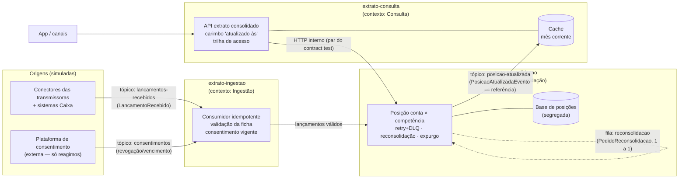

# Arquitetura — Consolidador de Extrato / Open Finance

> Diagrama de contextos + fluxo de eventos/filas (contrato de entrega §3).
> Fonte de verdade do domínio: `docs/requisitos/` (linguagem ubíqua no `user-stories.md`).

## Contextos delimitados

## Fluxos e garantias

| Fronteira | Canal | Contrato | Garantia declarada |
|---|---|---|---|
| Origens → Ingestão | **Tópico** `lancamentos-recebidos` | `LancamentoRecebido` | Pelo menos uma vez; **consumidor idempotente** (chave: instituição+id origem); fora de ordem aceito (competência = data de ocorrência) |
| Ingestão/Consolidação (falhas) | **DLQ** | mensagem original + causa | Falha temporária → retry com backoff (3×, exponencial); falha permanente → DLQ, sem perda e sem travar |
| Operação → Consolidação | **Fila** `reconsolidacao` | `PedidoReconsolidacao` | Consumo um a um (fila de trabalho); aceite imediato ao solicitante |
| Consolidação → assinantes | **Tópico** `posicao-atualizada` | `PosicaoAtualizadaEvento` | Pelo menos uma vez; pode atrasar/repetir; **só referência, sem dado pessoal** |
| Consulta → Consolidação | **HTTP** interno | posição por conta×competência | Par do **contract test** (PACT) |
| Consulta → canais | HTTP | extrato consolidado | Cache-first; invalidação por evento + TTL; carimbo "atualizado às"; meta < 5 min de frescor |

## Regras de fronteira

1. **Nenhum serviço lê a base do outro** (Sessão 6). Integração só por mensagem/evento ou API explícita.
2. `shared-contracts` contém **apenas** tipos que cruzam fronteiras.
3. Logs estruturados **sem dado pessoal**, com correlation id propagado por HTTP/tópico/fila (US-12 — opcional de observabilidade).

## Decisões

Ver `docs/adr/` — índice: ADR-001 (stack Quarkus), ADR-002 (decomposição). Pendentes (Sessão 6): desenho da consulta em cache miss, mecanismo de idempotência, consistência dos três efeitos, parâmetros de resiliência.

## Perfis de execução

- **A (docker, padrão):** brokers reais (Kafka, RabbitMQ, Redis) via Dev Services/Compose.
- **B (pura-JVM):** `mvn verify -Pplano-b-jvm` sem Docker — connector in-memory + Caffeine + H2. Perfil dos testes/CI.
- **C (conceitual):** este documento + ADRs + requisitos.
