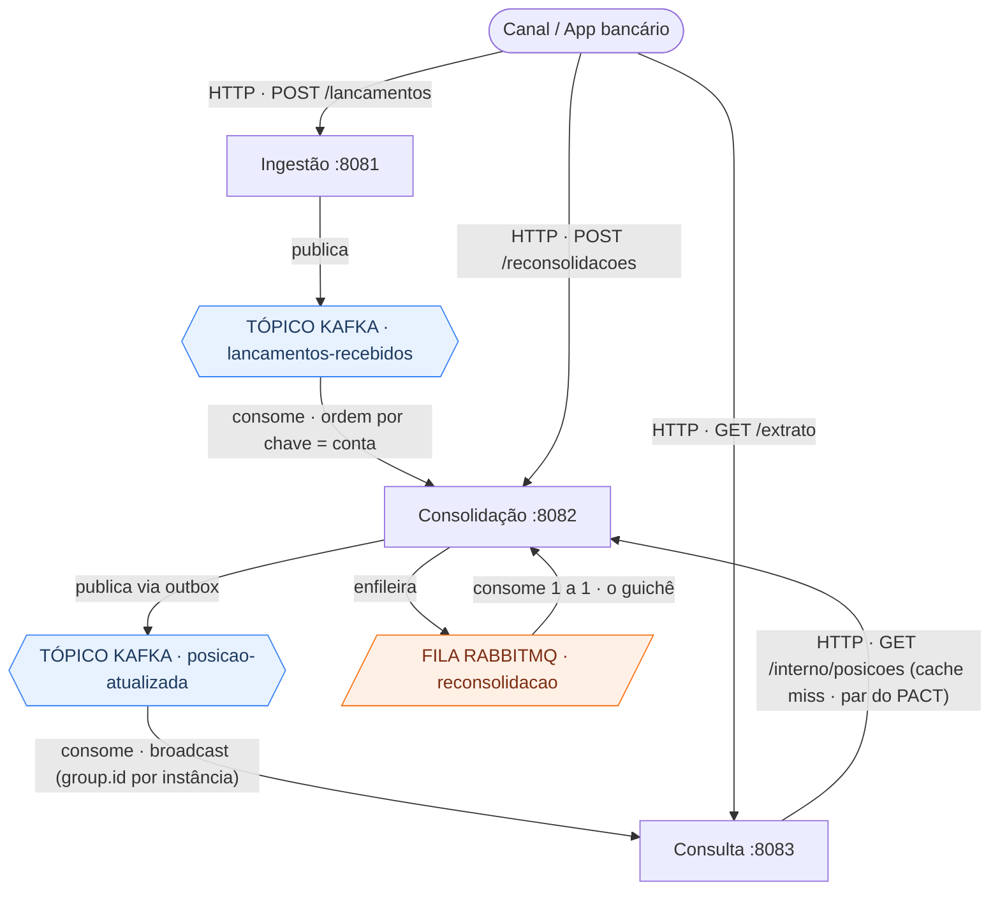
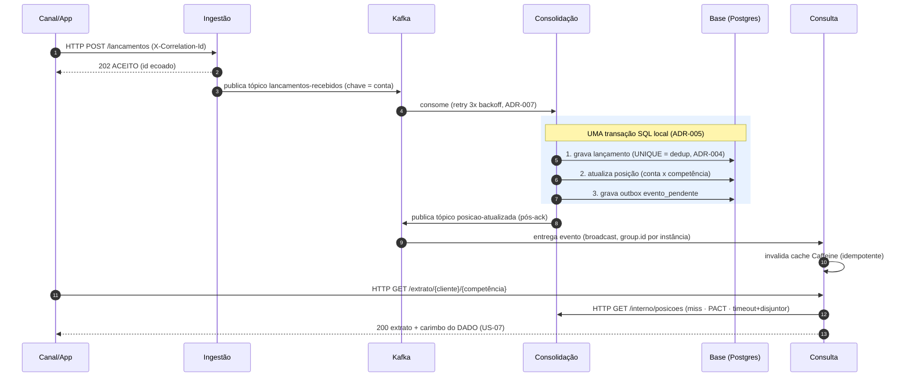
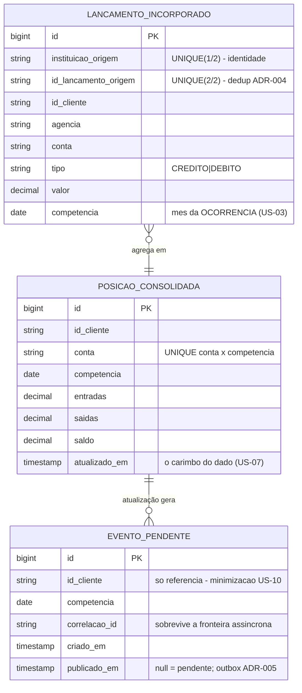
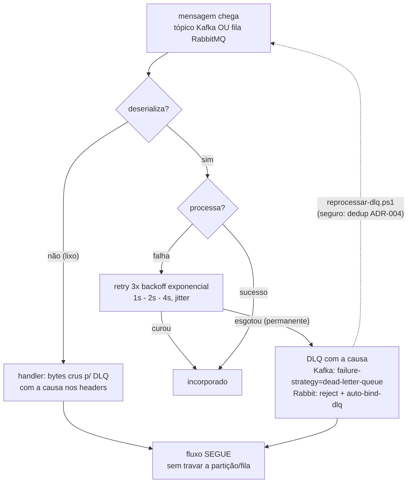
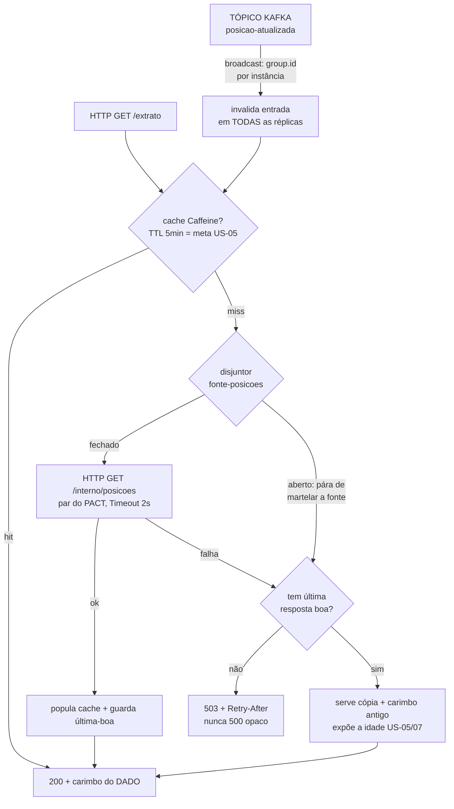

# Resumo visual — a cola da banca

> 1 página, 5 diagramas, os números do projeto. GitHub renderiza os Mermaid nativamente.

**Números:** 3 serviços · 9 ADRs (+índice) · 41 testes plano B + 35 asserções e2e no CI · 3 contratos PACT (2 HTTP + 1 mensagem) · 4 bugs reais achados no plano A · demo de 1 comando (`./demo.ps1`).

**Mecanismos de transporte** (código de cor nos diagramas): 🔵 **tópico Kafka** (pub-sub, ordem por chave) · 🟠 **fila RabbitMQ** (work queue, um a um) · seta simples = **HTTP/REST** (síncrono) · os 3 efeitos numa **transação SQL local** · **cache Caffeine** in-process.

## 1 · Mapa de transações e mecanismos — o que corre por onde (ADR-002)

> **Por que cada mecanismo:** **tópico Kafka** para eventos pub-sub com ordem por conta (quem publica não conhece quem consome); **fila RabbitMQ** para trabalho um-a-um com aceite imediato (o "guichê" da reconsolidação); **HTTP/REST** síncrono para comando e leitura — o miss do cache é governado por PACT.

## 2 · Fluxo feliz — os três efeitos e o outbox (ADRs 004/005)

> Transportes na sequência: **HTTP** (Canal↔serviços), **tópico Kafka** (ingestão→consolidação→consulta) e **transação SQL local** (os 3 efeitos).

## 3 · Estrutura de dados da consolidação (a dedup e a outbox são TABELAS)

## 4 · Régua de veneno em 3 camadas (ADR-007 + nota)

> Vale para os DOIS consumidores — o do **tópico Kafka** (`lancamentos-recebidos`) e o da **fila RabbitMQ** (`reconsolidacao`). A régua é a mesma; só muda o destino físico da DLQ.

## 5 · Cache da consulta: hit, miss, broadcast e disjuntor (ADR-006/007)

> Transportes aqui: **HTTP** para `GET /extrato` e o miss em `GET /interno/posicoes`; a invalidação chega por **tópico Kafka** (`posicao-atualizada`).

