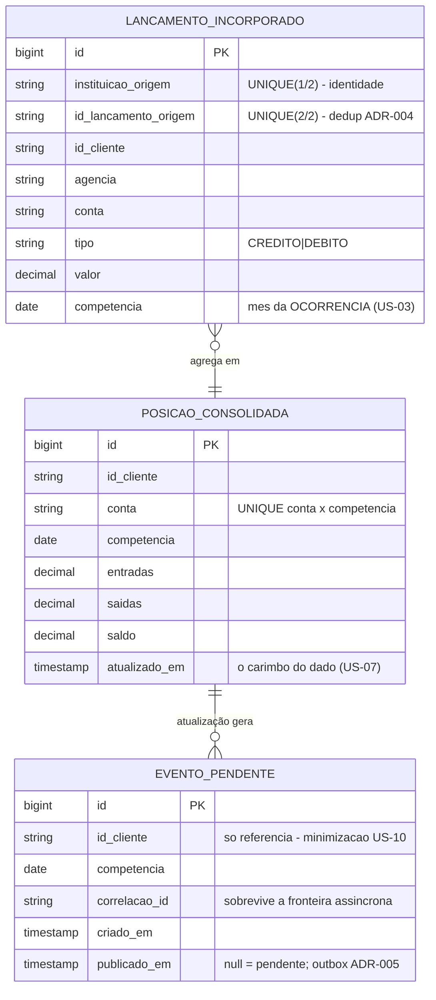

# Resumo visual — a cola da banca

> 1 página, 4 diagramas, os números do projeto. GitHub renderiza os Mermaid nativamente.

**Números:** 3 serviços · 7 ADRs (+índice) · 38 testes plano B + 27 asserções e2e no CI · 3 contratos PACT (2 HTTP + 1 mensagem) · 4 bugs reais achados no plano A · demo de 1 comando (`./demo.ps1`).

## 1 · Fluxo feliz — os três efeitos e o outbox (ADRs 004/005)

```mermaid
sequenceDiagram
    autonumber
    participant C as Canal/App
    participant I as Ingestão :8081
    participant K as Kafka
    participant Co as Consolidação :8082
    participant DB as Base segregada
    participant Q as Consulta :8083

    C->>I: POST /lancamentos (X-Correlation-Id)
    I-->>C: 202 ACEITO (id ecoado)
    I->>K: tópico lancamentos-recebidos (chave=conta, header correlation-id)
    K->>Co: consome (retry 3× backoff — ADR-007)
    rect rgb(232, 242, 255)
        note over Co,DB: UMA transação local (ADR-005)
        Co->>DB: 1. grava lançamento (UNIQUE = dedup, ADR-004)
        Co->>DB: 2. atualiza posição (conta×competência)
        Co->>DB: 3. grava evento_pendente (outbox, com correlacao_id)
    end
    Co-->>K: ack = "marcar processado" (reentrega? dedup ignora)
    Co->>K: @Scheduled publica posicao-atualizada (marca só pós-ack)
    K->>Q: evento (broadcast — group.id por instância)
    Q->>Q: invalida cache (idempotente por natureza)
    C->>Q: GET /extrato/{cliente}/{competencia}
    Q->>Co: miss → GET /interno/posicoes (par do PACT; @Timeout+disjuntor)
    Q-->>C: 200 extrato + carimbo do DADO (US-07)
```

## 2 · Estrutura de dados da consolidação (a dedup e a outbox são TABELAS)



*(Diagramas 3 — régua de veneno — e 4 — cache/disjuntor — na próxima sessão.)*
